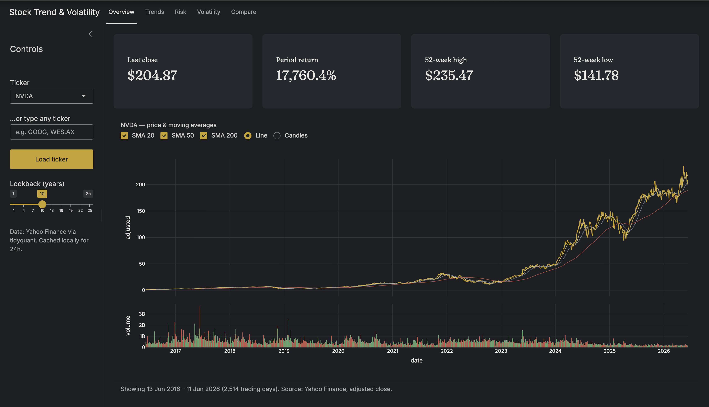
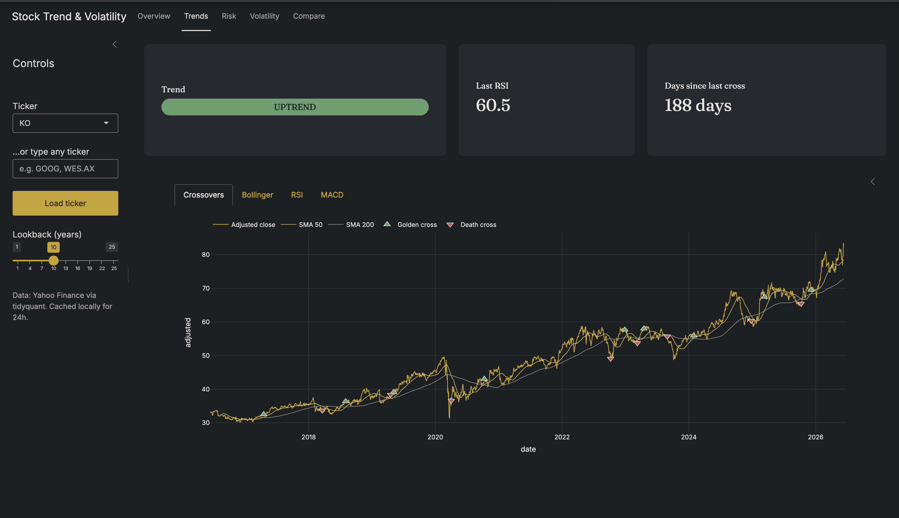
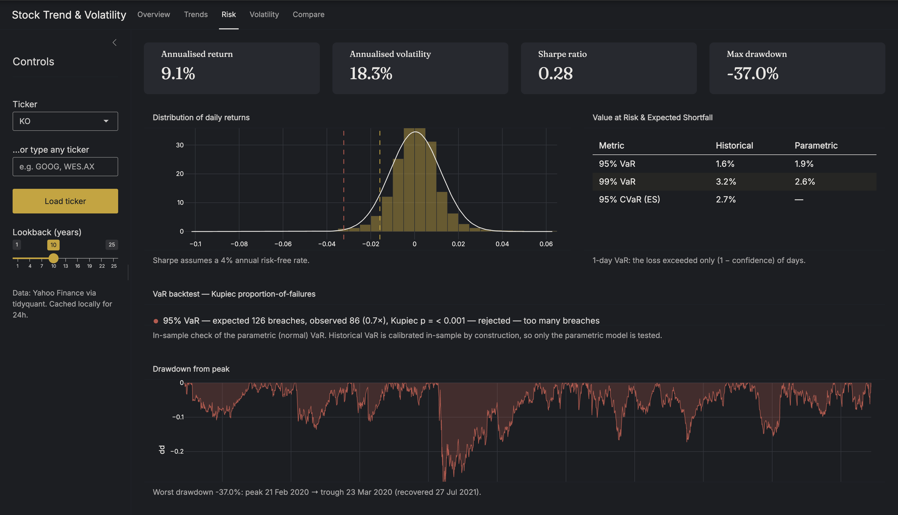
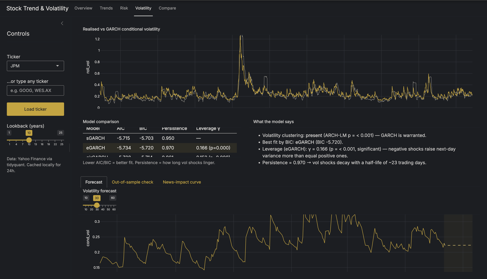
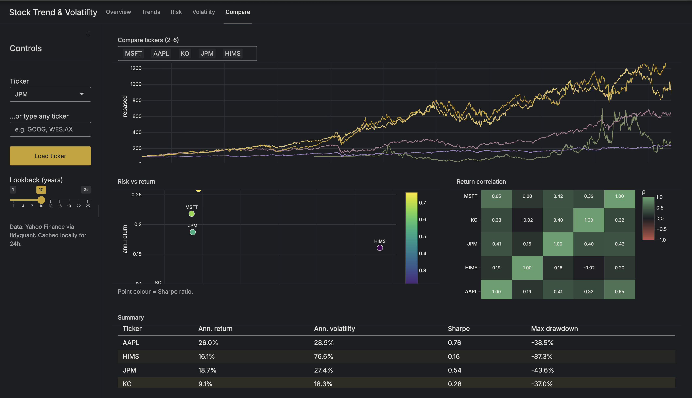

# Stock Trend Analysis & Volatility Insights

An interactive R/Shiny dashboard for equity **trend**, **risk**, and **volatility** analysis. It pulls live daily prices from Yahoo Finance, computes the indicators and risk statistics a desk analyst actually uses, and fits a family of GARCH models to quantify and forecast volatility – including the leverage effect that makes downside shocks hit harder than upside ones.

[](https://nihirasharma.shinyapps.io/stock-trend-volatility/)
&nbsp;

&nbsp;


> **Live demo:** https://nihirasharma.shinyapps.io/stock-trend-volatility/ &nbsp;·&nbsp; *(free tier sleeps – first load takes ~30 s)*



---

## What it does

Type any ticker – US (`NVDA`, `MSFT`), an index (`^GSPC`), or ASX (`CBA.AX`) – pick a lookback window, and five pages analyse it live. Everything is computed from **adjusted** close (split- and dividend-corrected) on **daily log returns**, the conventions that make the maths additive across time and consistent with the GARCH literature.

### Overview
Price with SMA 20/50/200 overlays (line or candlestick), a volume subplot coloured by up/down day, and value boxes for last close, period return, and 52-week high/low. The default NVDA view spans 10 years and ~2,500 trading days.



### Trends
A trend badge (uptrend / downtrend / sideways) derived from price vs SMA 200 and the 50/200 relationship, plus last RSI and days since the last crossover. The Crossovers tab marks every golden cross (gold ▲) and death cross (red ▼) against price and the two moving averages; tabs for Bollinger Bands, RSI, and MACD sit alongside.



### Risk
Annualised return, volatility, Sharpe, and max drawdown as headline stats. A distribution-of-returns chart overlays the empirical histogram with a fitted normal so the fat tails are visible, with 95%/99% VaR marked as cutoffs; a companion table reports historical and parametric VaR plus 95% CVaR (expected shortfall).

The page also backtests VaR using exceedance counts and the Kupiec proportion-of-failures test, answering a question most dashboards ignore: did the reported VaR actually get breached at roughly the rate it claimed Traffic-light indicators highlight under - or over-estimation of tail risk.

The drawdown panel charts underwater periods and annotates the worst peak → trough → recovery.



### Volatility 
The centrepiece. Rolling realised volatility plotted against GARCH conditional volatility, a model-comparison table across sGARCH / eGARCH / gjrGARCH (AIC, BIC persistence, leverage γ), a news-impact curve that visualises the asymmetry, a 10–60 day forecast, and a plain-English interpretation panel that translates the winning model's parameters into half-lives and leverage statements.

Before fitting any GARCH model, an ARCH-LM test checks whether volatility clustering is present and therefore whether GARCH modelling is warranted.

The page also evaluates predictive performance out-of-sample using an 80/20 train-test split: models are fit on the training window and forecast volatility into the held-out period, where forecast accuracy is compared against realised volatility and a constant-volatility benchmark.



### Compare
Two to six tickers side by side: cumulative returns rebased to 100, a risk-vs-return scatter coloured by Sharpe, a return-correlation heatmap, and a summary table. Dates are aligned across markets before correlating, so an ASX name and a US name are compared only on their common trading days.

---

## Findings

Numbers below are from the default ticker set over a 10-year window (to 11 Jun 2026). They're illustrative of *why* the tool exists, not investment advice.

- **A risk model is only useful if it survives backtesting.** The VaR backtest compares observed exceedances against the model's expected breach rate using the Kupiec proportion-of-failures test. Several equities showed materially more 99% VaR breaches than predicted by the normal distribution, reinforcing the conclusion that equity returns are fat-tailed and that parametric normal VaR systematically understates extreme downside risk.

- **The normal distribution lies about tail risk – in both directions.** For KO, the historical 95% 1-day VaR (1.6%) is *lower* than the parametric normal estimate (1.9%), but the historical 99% VaR (3.2%) is *higher* than parametric (2.6%). The normal fit overstates ordinary down days and understates the rare crisis day by roughly a quarter – the textbook fat-tail signature, visible directly on the Risk histogram.

- **Leverage is real and statistically significant for a bank.** On JPM, both asymmetric models reject symmetry: eGARCH γ = 0.166 and gjrGARCH γ = 0.152, each with p < 0.001. Negative shocks raise next-day variance materially more than equal-sized positive ones – exactly the dynamic a symmetric sGARCH model misses.

- **Volatility shocks have wildly different memory across names.** JPM's GARCH persistence of 0.970 implies a vol-shock half-life of ~23 trading days. HIMS sits at 0.998 – a near-unit-root process whose shocks decay with a half-life of ~279 days, so turbulence lingers for more than a year.

- **Raw return is a trap without risk adjustment.** In the compare set, MSFT posts the best Sharpe (0.66) on 27% annual volatility. HIMS earns a comparable headline return (16.1%) but its Sharpe collapses to 0.16, because 77% annualised volatility and an -87% drawdown swamp the return. The risk-vs-return scatter makes the trade-off legible at a glance.

- **Drawdowns recover on geological timescales.** HIMS fell −87.3% from its Feb-2021 peak to a May-2022 trough and did not reclaim that high until Jun 2024 – over three years underwater. KO's worst drawdown (−37.0%) was the Feb–Mar 2020 COVID crash, fully recovered by Jul 2021.

---

## Methodology

| Choice | Why |
| --- | --- |
| **Adjusted close** | Corrects for splits and dividends, so returns reflect total economic gain, not artefacts. |
| **Log returns** | Time-additive (sum of daily log returns = period log return) and the convention GARCH is built on. |
| **√252 annualisation** | 252 trading days/year; volatility scales with √time under an i.i.d. assumption – which GARCH then explicitly relaxes. |
| **Student-t innovations** | Equity returns are fat-tailed; a normal GARCH underestimates tail risk. `distribution.model = "std"` fits the kurtosis. |
| **VaR, both ways** | Historical VaR is non-parametric (no shape assumption); parametric (normal) VaR is its smooth counterpart. Reporting both shows where the normal assumption breaks. |
| **CVaR / Expected Shortfall** | The average loss *beyond* VaR – a coherent risk measure that captures how bad the tail gets, not just where it starts. |
| **GARCH family** | sGARCH (symmetric baseline), eGARCH and gjrGARCH (capture the leverage effect). Model choice by BIC. |
| **Kupiec VaR Backtest** | Tests whether observed VaR exceedances occur at the frequency the model claims. A 99% VaR should be breached on roughly 1% of days. |
| **ARCH-LM Test** | Checks whether volatility clustering exists before fitting GARCH models. Avoids applying volatility models where they are not warranted. |
| **Out-of-Sample Validation** | GARCH forecasts are evaluated on a held-out test set to distinguish explanatory power from genuine predictive performance. |

All risk and volatility maths lives in pure functions under `R/` and is covered by unit
tests with hand-computed expected values (see below).

---

## Architecture

```
app.R                 # global state: active ticker, lookback, shared prices() reactive, module mounting
global.R              # libraries, constants, theme, plotly_base_layout(); sources R/
stock-trend-volatility.Rproj
.gitignore
.rscignore
.lintr
README.md

R/
  data_fetch.R        # Yahoo Finance fetch, full-history RDS cache, stale-cache fallback
  indicators.R        # SMAs, RSI, MACD, Bollinger Bands, crossovers, trend classification
  plots.R             # all plotly charts and shared chart styling
  risk_metrics.R      # log returns, Sharpe, drawdown, VaR/CVaR, Kupiec tests, correlations
  utils.R             # formatting helpers, validation helpers, shared utilities
  volatility.R        # ARCH-LM, rolling vol, GARCH fits, forecasts, OOS validation, news impact

modules/
  mod_compare.R       # multi-ticker comparison page
  mod_overview.R      # price, volume, stats overview page
  mod_risk.R          # risk metrics, VaR, backtesting, drawdown page
  mod_trends.R        # RSI, MACD, Bollinger, crossover page
  mod_volatility.R    # GARCH modelling, forecast, validation page

tests/
  test_compare.R
  test_data_fetch.R
  test_indicators.R
  test_risk_metrics.R
  test_volatility.R

screenshots/
  overview.png        # Overview page screenshot
  trends.png          # Trends page screenshot
  risk.png            # Risk page screenshot
  volatility.png      # Volatility page screenshot
  compare.png         # Compare page screenshot

www/
  custom.css          # app styling
```

Three design rules kept it maintainable:

1. **All maths is pure and lives in `R/`.** Functions take a data frame and return a data frame or list – no `input$`, no `reactive()`, no `render*()`. That's what makes them testable and reusable.
2. **Modules own pages; `app.R` owns only global state.** Each page receives the shared `prices()` reactive and owns just its page-local controls. `app.R` stays under 80 lines.
3. **Caching is two-layered.** Full price history is fetched once and cached to RDS, so any lookback change filters locally with no refetch. GARCH fits – the expensive step – are memoised, keyed on the return series and model, so revisiting a ticker is instant.

---

## Run locally

```r
install.packages(c(
  "shiny", "bslib", "tidyquant", "tidyverse", "plotly",
  "TTR", "PerformanceAnalytics", "rugarch", "zoo",
  "shinycssloaders", "memoise", "testthat", "rsconnect"
))

shiny::runApp()
```

First launch fetches and caches price history, so give it a moment. Subsequent loads are served from the local `cache/`.

## Tests

```r
testthat::test_dir("tests")
```

The suite asserts against hand-computed values: crossover detection on a toy series with known flip points, RSI bounded in [0, 100], drawdown peak/trough/recovery on a
five-point path, 95% VaR ≈ 1.645% on simulated N(0, 0.01) data, CVaR > VaR, rolling-vol warm-up, and correct log-return arithmetic against the data layer.

---

## Stack

R · Shiny (bslib) · tidyquant · TTR · PerformanceAnalytics · rugarch · plotly · zoo · memoise · testthat

---

## Future work

- Add downloadable PDF risk reports using R Markdown.
- Add rolling beta vs `^GSPC` and rolling correlation analysis.
- Add portfolio-level analysis with custom ticker weights.
- Add benchmark comparison for each ticker against `^GSPC`.
- Add model diagnostics for GARCH residuals, including QQ plots and Ljung-Box tests.
- Add deployment monitoring and clearer fallback messages when Yahoo Finance data is unavailable.

---

*Data: Yahoo Finance via `tidyquant`, adjusted close. This project is for analysis and demonstration only and is not investment advice.*